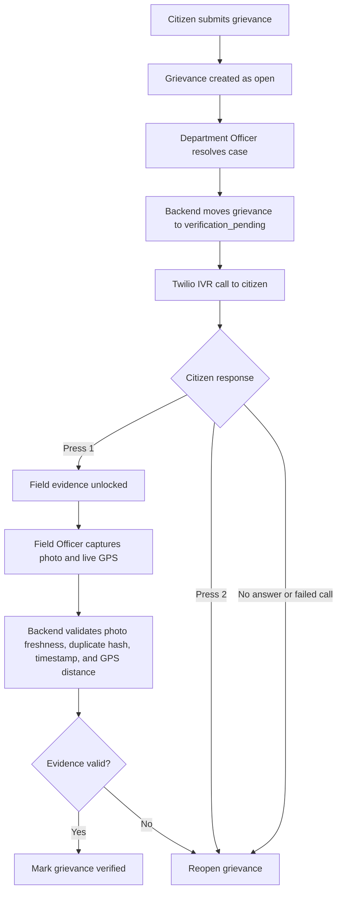

# SakshyaAI - Smart Grievance Verification System

SakshyaAI is a role-based grievance workflow for checking whether a department's claimed resolution is actually complete. It combines citizen IVR confirmation, field officer photo evidence, live GPS validation, and automatic reopen decisions.

The system is designed for a Swagat-style governance flow:

1. A citizen files a grievance with complaint location and phone number.
2. A department officer clicks `Resolve and Call Citizen` after completing work.
3. The backend triggers a Twilio IVR call.
4. If the citizen presses `1`, field evidence unlocks.
5. A field officer uploads a fresh camera photo and live GPS.
6. The backend verifies photo freshness, duplicate hash, timestamp, and GPS distance.
7. The grievance becomes `verified` only when IVR, photo, and GPS all pass.
8. Citizen dispute, no answer, suspicious GPS, or invalid evidence reopens the grievance.

## Workflow Diagram



## Current Features

- Citizen grievance submission with category, priority, department, address, and GPS coordinates.
- Role-based dashboards for citizen, department officer, field officer, and collector.
- Department verification queue for `open`, `reopened`, and `verification_pending` cases.
- Real Twilio IVR flow with Gujarati audio prompt support.
- Mock IVR mode for local demos without placing calls.
- Field evidence upload with JPEG/PNG validation.
- GPS distance check with configurable threshold.
- Duplicate photo detection through image hashing.
- Automatic reopen for citizen dispute, no IVR response, missing evidence timeout, bad GPS, or invalid photo.
- Collector dashboard and department score overview.
- PostgreSQL migrations and seed data.
- React + Vite frontend.

## Tech Stack

- Frontend: React 18, Vite, CSS
- Backend: Node.js, Express
- Database: PostgreSQL, Sequelize
- IVR: Twilio Voice
- Evidence validation: local file storage or optional Cloudinary
- Optional queue infra: Redis / BullMQ

Redis is optional for local development. If Redis is not running, the backend logs a warning and continues in direct processing mode.

## Repository Structure

```text
tark-shastra/
|- backend/
|  |- server.js
|  |- .env.example
|  |- src/
|  |  |- config/
|  |  |- middleware/
|  |  |- models/
|  |  |- queues/
|  |  |- routes/
|  |  |- seed/
|  |  |- services/
|  |  `- utils/
|  `- package.json
|- frontend/
|  |- src/
|  |  |- legacy/app.js
|  |  |- styles/app.css
|  |  |- App.jsx
|  |  |- main.jsx
|  |  `- markup.js
|  |- index.html
|  `- package.json
|- migrations/
|- gj_audio.mp3
|- package.json
`- README.md
```

## Prerequisites

- Node.js 18 or newer
- PostgreSQL 13 or newer
- Git
- Optional: Redis
- Optional for real IVR: Twilio account and ngrok or another public HTTPS tunnel

## Database Setup

Create the PostgreSQL database:

```sql
CREATE DATABASE grievance_db;
```

The backend runs SQL migrations automatically on startup. You can also inspect the migration files in `migrations/`.

## Environment Setup

Create the backend environment file:

```bash
cd backend
cp .env.example .env
```

On Windows PowerShell:

```powershell
Copy-Item .env.example .env
```

Edit `backend/.env`:

```env
PORT=5000
DB_HOST=localhost
DB_PORT=5432
DB_NAME=grievance_db
DB_USER=postgres
DB_PASSWORD=postgres
JWT_SECRET=change_this_secret_before_deployment
BASE_URL=http://localhost:5000
MOCK_MODE=true
```

Keep `backend/.env` private. It is ignored by git.

## Install Dependencies

From the repo root:

```bash
npm --prefix backend install
npm --prefix frontend install
```

Or install inside each folder:

```bash
cd backend
npm install

cd ../frontend
npm install
```

## Seed Demo Data

Run the Sequelize seed script:

```bash
npm --prefix backend run seed
```

This clears existing application data and creates demo departments, users, grievances, and one pending verification log.

Demo login credentials:

| Role | Username | Password |
| --- | --- | --- |
| Collector | `collector` or `collector@example.com` | `collector123` |
| Department Officer | `dept_rbd` or `dept_rbd@example.com` | `dept123` |
| Field Officer | `officer1` or `officer1@example.com` | `officer123` |
| Citizen | `citizen1` or `citizen1@example.com` | `citizen123` |

## Run Locally

Start the backend:

```bash
npm --prefix backend start
```

Backend health check:

```text
http://localhost:5000/api/health
```

Start the frontend:

```bash
npm --prefix frontend run dev
```

Frontend:

```text
http://127.0.0.1:5173
```

The frontend API base defaults to:

```text
http://localhost:5000
```

To override it:

```env
VITE_API_BASE_URL=http://localhost:5000
```

## Real Twilio IVR Setup

Twilio cannot call `localhost`. For real IVR calls, expose the backend through a public HTTPS URL.

Start ngrok:

```bash
ngrok http 5000
```

Copy the HTTPS URL and set:

```env
MOCK_MODE=false
BASE_URL=http://localhost:5000
PUBLIC_BASE_URL=https://your-ngrok-url.ngrok-free.app
TWILIO_ACCOUNT_SID=ACxxxxxxxxxxxxxxxxxxxxxxxxxxxxxxxx
TWILIO_AUTH_TOKEN=your_twilio_auth_token
TWILIO_PHONE_NUMBER=+1xxxxxxxxxx
```

Optional testing override:

```env
TO_PHONE_NUMBER=+91xxxxxxxxxx
```

When `TO_PHONE_NUMBER` is set, every IVR call goes to that number instead of the citizen's saved phone. This is useful for demos.

Restart the backend after changing `.env`.

## Why Calls Do Not Trigger

If `MOCK_MODE=false` and no public HTTPS URL is configured, the backend refuses to start the real call and returns a setup hint. This prevents cases from getting stuck in `verification_pending` when Twilio cannot reach the webhook.

Correct real-call setup:

```env
PUBLIC_BASE_URL=https://your-public-url
MOCK_MODE=false
```

Correct local-demo setup:

```env
MOCK_MODE=true
```

## IVR Flow

The department officer clicks `Resolve and Call Citizen`.

Backend behavior:

- Moves the grievance to `verification_pending`.
- Creates a new verification log.
- Calls Twilio through `makeIvrCall`.
- Uses `PUBLIC_BASE_URL/api/ivr/welcome?grievanceId=...` as the Twilio webhook.
- If call creation fails, restores the grievance to its previous status.

Citizen keypad response:

| Digit | Meaning | System Action |
| --- | --- | --- |
| `1` | Citizen confirms work is resolved | Wait for field officer photo and GPS |
| `2` | Citizen disputes work | Reopen grievance |
| No answer / failed call | No confirmation | Reopen grievance |

## Field Evidence Flow

After citizen presses `1`, the field officer opens the Evidence page and uploads:

- Fresh camera photo
- Live browser GPS latitude
- Live browser GPS longitude
- Capture timestamp

The backend checks:

- Photo exists and is JPEG/PNG
- Image quality basics
- Duplicate image hash
- Timestamp is after the department marked the case resolved
- GPS distance is within `GPS_THRESHOLD_METERS`

Final status:

| Condition | Final Status |
| --- | --- |
| IVR = `1`, photo valid, GPS valid | `verified` |
| Citizen disputes | `reopened` |
| Citizen does not answer | `reopened` |
| GPS mismatch | `reopened` |
| Photo invalid or duplicate | `reopened` |
| Waiting for IVR or evidence | `verification_pending` |

## API Overview

Auth:

- `POST /api/auth/register`
- `POST /api/auth/login`

Grievances:

- `POST /api/grievances` - citizen creates grievance
- `GET /api/grievances` - list role-filtered grievances
- `GET /api/grievances/:id` - grievance detail with latest verification log
- `POST /api/grievances/:id/resolve` - department/collector starts IVR verification

IVR:

- `POST /api/ivr/welcome` - Twilio welcome webhook
- `POST /api/ivr/response` - Twilio keypad response webhook
- `POST /api/ivr/status` - Twilio call status webhook
- `POST /api/ivr/audio` - collector uploads custom IVR audio
- `GET /api/ivr/audio/gj_audio.mp3` - bundled Gujarati prompt

Evidence:

- `POST /api/evidence/upload` - field officer uploads photo and GPS evidence
- `GET /api/evidence/:grievanceId` - evidence history

Departments and collector:

- `GET /api/departments`
- `GET /api/departments/:id/score`
- `GET /api/collector/dashboard`
- `GET /api/collector/failed-verifications`
- `GET /api/collector/audit/:grievanceId`

## Useful Scripts

Root:

```bash
npm run dev:frontend
npm run dev:backend
npm run start:backend
npm run build
```

Backend:

```bash
npm start
npm run dev
npm run seed
npm test
```

Frontend:

```bash
npm run dev
npm run build
npm run preview
```

On some Windows machines, PowerShell blocks `npm.ps1`. Use `npm.cmd`:

```powershell
npm.cmd --prefix backend start
npm.cmd --prefix frontend run dev
```

## Troubleshooting

### Citizen cannot submit a grievance

- Sign in as a citizen.
- Ensure the department dropdown has a selected value.
- Ensure latitude and longitude are valid numbers.
- Check backend health at `http://localhost:5000/api/health`.

### Resolve button does not place a call

- If using real Twilio, set `PUBLIC_BASE_URL` to a public HTTPS URL.
- Confirm `MOCK_MODE=false`.
- Confirm Twilio credentials and `TWILIO_PHONE_NUMBER`.
- Restart the backend after editing `.env`.
- For local demo only, set `MOCK_MODE=true`.

### Twilio says webhook failed

- Check that ngrok is still running.
- Check that `PUBLIC_BASE_URL` is the current ngrok HTTPS URL.
- Restart backend after changing the URL.
- Ensure Twilio can reach `/api/ivr/welcome`.

### Evidence upload is rejected

- Citizen must press `1` first.
- Capture live GPS before upload.
- Photo timestamp must be after the department marked the case resolved.
- GPS must be within `GPS_THRESHOLD_METERS`.

### Redis warning on startup

This is okay for local development. The backend continues without queue workers.

### No tests found

The backend has Jest configured but currently does not include test files.

## Security Notes

- Never commit `backend/.env`.
- Rotate Twilio or Cloudinary credentials if they are exposed.
- Use a strong `JWT_SECRET` outside local development.
- Use HTTPS for public webhook URLs.

## License

This project is intended for hackathon and prototype use. Add a formal license before production or public distribution.
